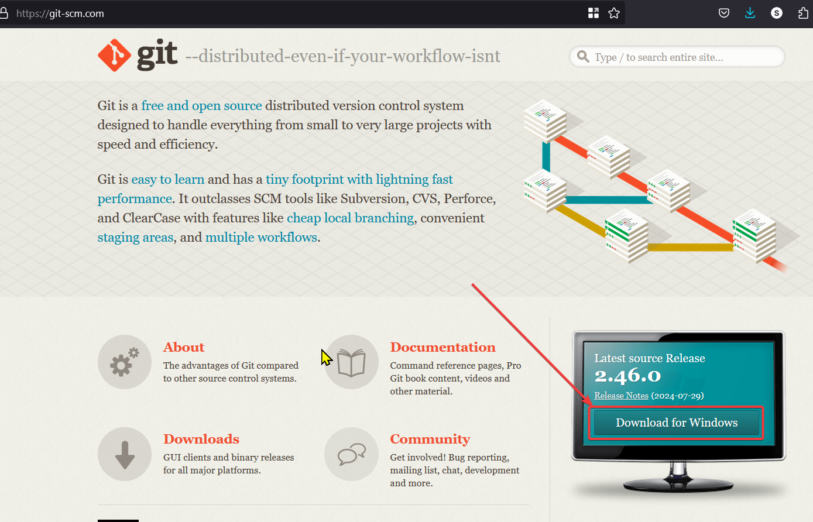
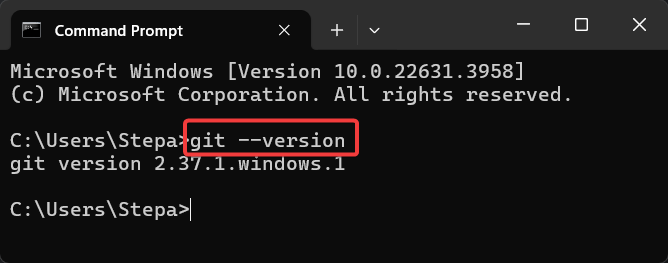
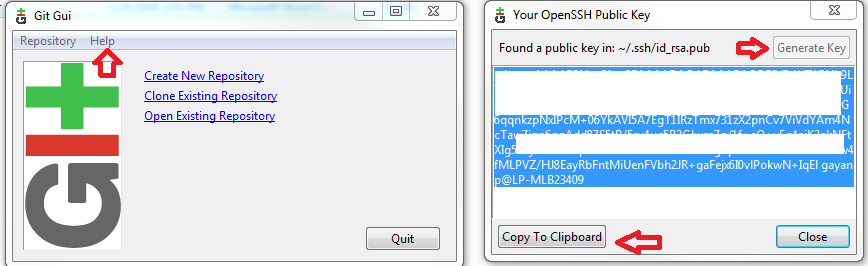

# Git
## Jak naistalovat git
1) stahnout git z https://git-scm.com/

2) instalace
3) overeni instalace 
 

Kdyz to pise "git version X.XX...." tak je to ok.

# Github 
https://github.com/

Abych nemusel stale zadavat heslo pri kazdem push na server:
### pridani ssh klice na github
https://docs.github.com/en/authentication/connecting-to-github-with-ssh/adding-a-new-ssh-key-to-your-github-account
Coz je v podstate:
Profil > Settings > SSH and GPG keys > New SSH key

### vygenerovani noveho SSH key: 
Nejjednodussi je to pres GUI git (je naistalovan pri instalaci git na windows.
1. Help > Show SSH
2. Generate key
3. Copy to Clipboard

# Git v IntelliJ
1. `Alt`+`0`
2. oznacit soubory pro commit
3. Commit / Commit and Push

