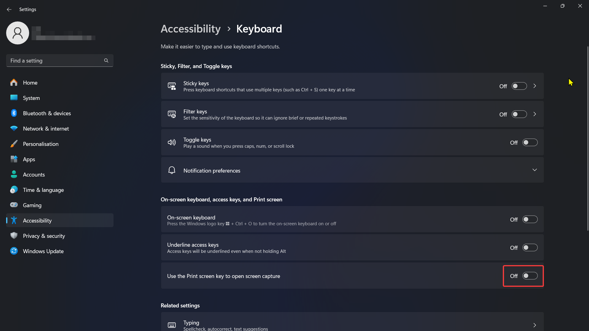

# ShareX 
ShareX je mym oblibenym softem na delani screenshotu.

### Plusy:
1) zdarma
2) na vsechny platformy
3) skvele klavesove zkratky
4) screenshoty se ukladaji na disk, kde jsou normalne pristupne
### Minusy
1) interface by mohl byt hezci

## Kde to sezenu? 
https://getsharex.com/

Je to i na Microsoft Store

## Nastaveni
### Windows 11 shortcut
1. Press the Win + I keyboard shortcut to open the Settings app.
2. On the left, click the Accessibility item.
3. Now, click on the Keyboard button in the right pane.
4. Finally, disable the Use the Print Screen button to open Snipping Tool toggle option.
5. Disable Snipping Tool
6. Then you go to Settings for ShareX and disable and enable Prt Screen. Then it works again

### Workflow
#### Editovani po screenshotu

